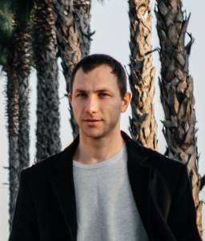

## Васнев Александр Сергеевич
## Начинающий Frontend-разработчик

Рассматриваю смену профессии в качестве Frontend-разработчика. В данный момент прохожу обучение в онлайн-школе по профессии "Веб-разработчик с нуля" (fullstack-разработчик) и ищу возможности использования уже полученных навыков в HTML / CSS / JS. Готов выполнить тестовое задание, чтобы продемонстрировать уровень этих навыков.

## Контакты

- Телефон: +7 918 916 7944;
- Мой Telegram: @sane_vasne;
- email: a.s.vasnev88@yandex.ru.

## Навыки

### JavaScript

- знаю базовые структуры данных JS;
- понимаю принципы ООП;
- умею работать с DOM элементами;
- умею работать с асинхронными функциями, функциями декораторами, классами;
- использую современные возможности ES6;
- [ДЗ по модулю](https://github.com/Alexandr7944/bjs-2-homeworks).

### CSS

- умею создавать [адаптивную верстку](https://alexandr7944.github.io/mq-diploma-master/) при помощи медиа-выражений;
- использую [flexbox и grid](https://alexandr7944.github.io/training_site/) раскладку;
- знаю базовые принципы БЭМ.

### HTML

- знаю понятие потока документа;
- знаю отличие блочного и строчного элементов;
- использую HTML-теги в соответствии с их семантикой.
  
### Git

- знаю основные команды git;
- умею создавать пулл реквесты;
- использую подход "один коммит, одна задача";
- [мой GitHub](https://github.com/Alexandr7944).

### Tools

Есть опыт использования Figma и Photopea для работы с дизайн-макетами. Использую редактор Visual Studio Code с плагинами [Emmet](certification/stepik-certificate-113654-f03cc9a.pdf) и Prettier.

## Образование

### "Веб-разработчик с нуля"
01.2022 - 10.2023, Нетология, курсы по веб-разработке.

### Инженер
2012, Омский государственный университет путей сообщения, Электроснабжение ж/д транспорта.

### Техник
2007, Омский техникум железнодорожного транспорта, Электроснабжение ж/д транспорта.

## Предыдущий опыт работы

- Инженер по организации эксплуатации и ремонту, с 2017г. по настоящее время, ООО "Свод Интернешнл" (договорная работа в сфере услуг, сметное дело, эксплуатация электрооборудования силами контрагентов и подчиненного персонала);
  
- Инженер-энергетик, 2015 - 2017, ПАО "МТС" (оформление новых точек подключений электроэнергии базовых станций и эксплуатации уже имеющихся);
  
- Ведущий специалист, 2012-2014, ООО "ИТС";
  
- Элетромеханик контактной сети, 2007-2012, ПАО "РЖД".
